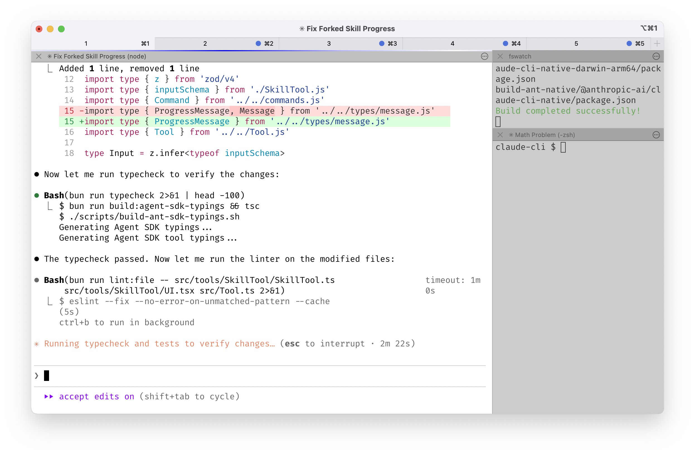
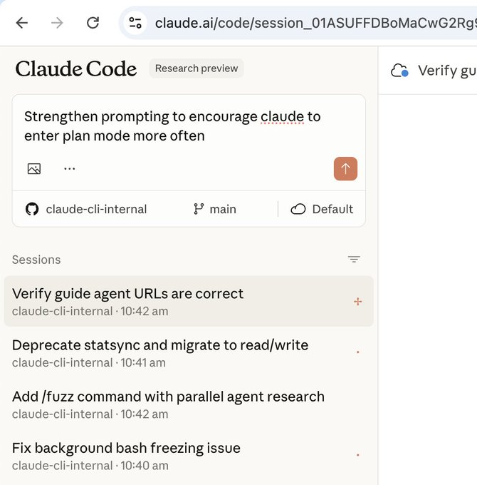
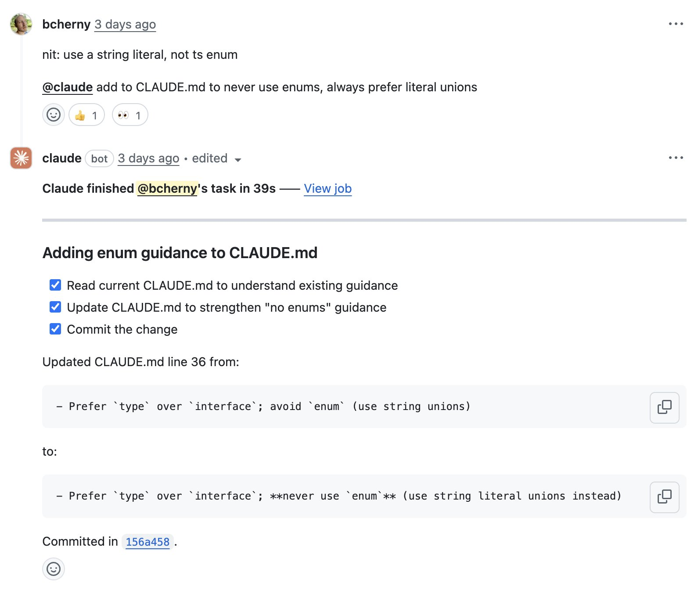
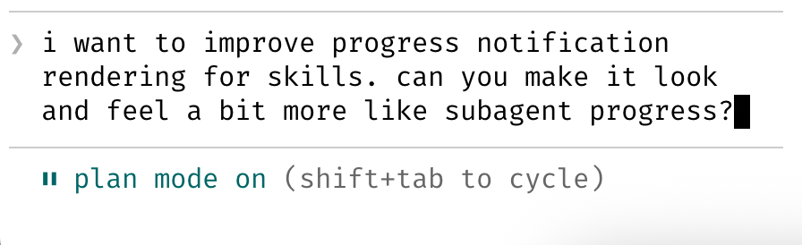
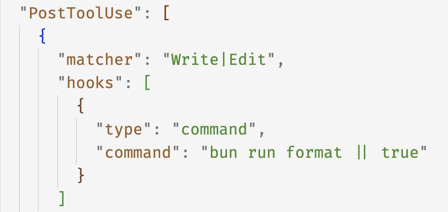
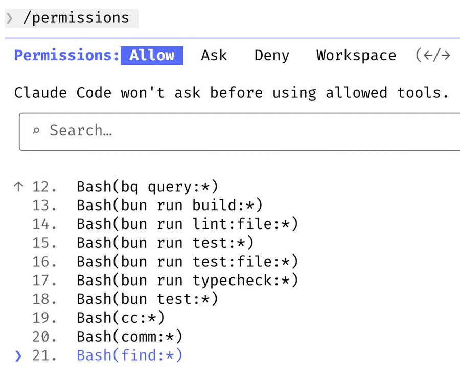

## Boris Claude Code Setup

1. I run 5 Claudes in parallel in my terminal. I number my tabs 1-5, and use system notifications to know when a Claude needs input 



Use Iterm 2, [Notification setup](https://code.claude.com/docs/en/terminal-config#iterm-2-system-notifications)

2. I also run 5-10 Claudes on http://claude.ai/code, in parallel with my local Claudes. As I code in my terminal, I will often hand off local sessions to web (using &), or manually kick off sessions in Chrome, and sometimes I will --teleport back and forth. I also start a few sessions from my phone (from the Claude iOS app) every morning and throughout the day, and check in on them later.



3. I use Opus 4.5 with thinking for everything. It's the best coding model I've ever used, and even though it's bigger & slower than Sonnet, since you have to steer it less and it's better at tool use, it is almost always faster than using a smaller model in the end.

4. Our team shares a single CLAUDE.md for the Claude Code repo. We check it into git, and the whole team contributes multiple times a week. Anytime we see Claude do something incorrectly we add it to the CLAUDE.md, so Claude knows not to do it next time.

Other teams maintain their own CLAUDE.md's. It is each team's job to keep theirs up to date.

```markdown
# Development Workflow

**Always use `bun`, not `npm`.**

```sh
# 1. Make changes


# 2. Typecheck (fast)
bun run typecheck


# 3. Run tests
bun run test -- -t "test name"        # Single suite
bun run test:file -- "glob"           # Specific files


# 4. Lint before committing
bun run lint:file -- "file1.ts"       # Specific files
bun run lint                         # All files


# 5. Before creating PR
bun run lint:claude && bun run test
```
```

5. During code review, I will often tag @.claude on my coworkers' PRs to add something to the CLAUDE.md as part of the PR. We use the Claude Code Github action (/install-github-action) for this. It's our version of 
@danshipper's Compounding Engineering



6. Most sessions start in Plan mode (shift+tab twice). If my goal is to write a Pull Request, I will use Plan mode, and go back and forth with Claude until I like its plan. From there, I switch into auto-accept edits mode and Claude can usually 1-shot it. A good plan is really important!



7. I use slash commands for every "inner loop" workflow that I end up doing many times a day. This saves me from repeated prompting, and makes it so Claude can use these workflows, too. Commands are checked into git and live in .claude/commands/.

For example, Claude and I use a /commit-push-pr slash command dozens of times every day. The command uses inline bash to pre-compute git status and a few other pieces of info to make the command run quickly and avoid back-and-forth with the model

[https://code.claude.com/docs/en/slash-commands#bash-command-execution](https://code.claude.com/docs/en/slash-commands#bash-command-execution)


8. I use a few subagents regularly: code-simplifier simplifies the code after Claude is done working, verify-app has detailed instructions for testing Claude Code end to end, and so on. Similar to slash commands, I think of subagents as automating the most common workflows that I do for most PRs.

[https://code.claude.com/docs/en/sub-agents](https://code.claude.com/docs/en/sub-agents)


9. We use a PostToolUse hook to format Claude's code. Claude usually generates well-formatted code out of the box, and the hook handles the last 10% to avoid formatting errors in CI later.



10. I don't use --dangerously-skip-permissions. Instead, I use /permissions to pre-allow common bash commands that I know are safe in my environment, to avoid unnecessary permission prompts. Most of these are checked into .claude/settings.json and shared with the team.



11. Claude Code uses all my tools for me. It often searches and posts to Slack (via the MCP server), runs BigQuery queries to answer analytics questions (using bq CLI), grabs error logs from Sentry, etc. The Slack MCP configuration is checked into our .mcp.json and shared with


12. For very long-running tasks, I will either (a) prompt Claude to verify its work with a background agent when it's done, (b) use an agent Stop hook to do that more deterministically, or (c) use the [ralph-wiggum plugin](https://github.com/anthropics/claude-code/tree/main/plugins/ralph-wiggum) (originally dreamt up by @GeoffreyHuntley). I will also use either --permission-mode=dontAsk or --dangerously-skip-permissions in a sandbox to avoid permission prompts for the session, so Claude can cook without being blocked on me.

[https://code.claude.com/docs/en/hooks-guide](https://code.claude.com/docs/en/hooks-guide)

13. A final tip: probably the most important thing to get great results out of Claude Code -- give Claude a way to verify its work. If Claude has that feedback loop, it will 2-3x the quality of the final result.

Claude tests every single change I land to http://claude.ai/code using the Claude Chrome extension. It opens a browser, tests the UI, and iterates until the code works and the UX feels good.

Verification looks different for each domain. It might be as simple as running a bash command, or running a test suite, or testing the app in a browser or phone simulator. Make sure to invest in making this rock-solid.

[code.claude.com/docs/en/chrome](code.claude.com/docs/en/chrome)