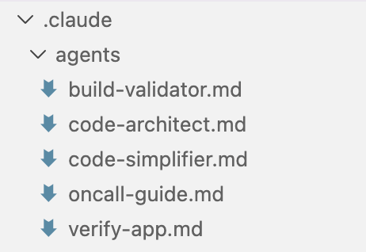
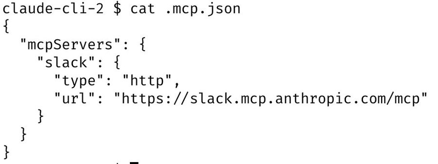

## Boris Claude Code Setup

1. I run 5 Claudes in parallel in my terminal. I number my tabs 1-5, and use system notifications to know when a Claude needs input 


Use Iterm 2, [Notification setup](https://code.claude.com/docs/en/terminal-config#iterm-2-system-notifications)

> **Implementation:** In iTerm2, go to Preferences → Profiles → Terminal → enable "Silence bell" and "Send Growl/Notification Center alerts". For Shell Integration, run `curl -L https://iterm2.com/shell_integration/install_shell_integration.sh | bash` and add `source ~/.iterm2_shell_integration.zsh` to your `~/.zshrc`. You'll get macOS notifications when Claude finishes and needs input.

2. I also run 5-10 Claudes on http://claude.ai/code, in parallel with my local Claudes. As I code in my terminal, I will often hand off local sessions to web (using &), or manually kick off sessions in Chrome, and sometimes I will --teleport back and forth. I also start a few sessions from my phone (from the Claude iOS app) every morning and throughout the day, and check in on them later.


> **Implementation:** Use `claude --resume` or `claude -c` to continue sessions. The `&` suffix uploads your session to claude.ai/code for web continuation. Use `claude --teleport` to pull a web session back to terminal. For iOS, install the Claude app and your sessions sync automatically. Web sessions at claude.ai/code share the same context and can run while you work locally.

3. I use Opus 4.5 with thinking for everything. It's the best coding model I've ever used, and even though it's bigger & slower than Sonnet, since you have to steer it less and it's better at tool use, it is almost always faster than using a smaller model in the end.

> **Implementation:** Run `/model` in Claude Code and select "claude-opus-4-5-20251101" or "Opus 4.5". Thinking is enabled by default. You can also set it permanently with `claude config set model claude-opus-4-5-20251101`. The extended thinking helps Claude reason through complex multi-file changes and reduces back-and-forth corrections.

4. Our team shares a single CLAUDE.md for the Claude Code repo. We check it into git, and the whole team contributes multiple times a week. Anytime we see Claude do something incorrectly we add it to the CLAUDE.md, so Claude knows not to do it next time.

Other teams maintain their own CLAUDE.md's. It is each team's job to keep theirs up to date.

Create title `# Development Workflow`, "**Always use `bun`, not `npm`.**", then copy the shell scripts

```sh
# 1. Make changes


# 2. Typecheck (fast)
bun run typecheck


# 3. Run tests
bun run test -- -t "test name"        # Single suite
bun run test:file -- "glob"           # Specific files


# 4. Lint before committing
bun run lint:file -- "file1.ts"       # Specific files
bun run lint                         # All files


# 5. Before creating PR
bun run lint:claude && bun run test
```

> **Implementation:** Create `CLAUDE.md` in your project root. Structure it with sections like `# Development Workflow`, `# Project Structure`, `# Common Mistakes to Avoid`. Add entries whenever Claude makes a mistake: "Never use `npm`, always use `bun`", "Always run tests before committing", etc. Commit to git so the team shares learnings. Claude reads this file automatically at session start.

5. During code review, I will often tag @.claude on my coworkers' PRs to add something to the CLAUDE.md as part of the PR. We use the Claude Code Github action (/install-github-action) for this. It's our version of 
@danshipper's Compounding Engineering


> **Implementation:** Run `/install-github-action` in Claude Code to set up the GitHub Action. Once installed, comment `@.claude <instruction>` on any PR. Claude will read the PR diff, follow your instruction, and commit changes. Use it to add CLAUDE.md entries, fix code style, add tests, or update docs. The action runs in GitHub's CI environment with access to your repo.

6. **ALWAYS start coding tasks in Plan mode** (shift+tab twice). This is non-negotiable for quality results. Plan mode prevents wasted effort and ensures alignment before Claude writes any code. Use it for:
   - Any PR you're creating (100% of PRs should start with a plan)
   - Multi-file changes or refactors
   - New features (even small ones - "where should the button go?")
   - Bug fixes that aren't single-line typos
   - Performance optimizations
   - Any task where the approach isn't immediately obvious

Once you approve the plan, switch to auto-accept edits mode and Claude will execute perfectly. A good plan is the difference between a 1-shot success and 3 rounds of back-and-forth.


> **Implementation:** Press `Shift+Tab` twice to enter Plan mode (you'll see "Plan" indicator). In this mode, Claude explores the codebase and drafts a plan without making changes. Review and iterate on the plan with follow-up prompts. When satisfied, press `Shift+Tab` once to switch to Act mode, then press `Shift+Tab` again to enable auto-accept edits. Claude will execute the plan without prompting for each file change.
>
> **Critical Rule:** If you're unsure whether to use plan mode, USE IT. The cost of planning is ~30 seconds. The cost of incorrect implementation is 5+ minutes of fixes. Default to planning.

7. I use slash commands for every "inner loop" workflow that I end up doing many times a day. This saves me from repeated prompting, and makes it so Claude can use these workflows, too. Commands are checked into git and live in .claude/commands/.

For example, Claude and I use a /commit-push-pr slash command dozens of times every day. The command uses inline bash to pre-compute git status and a few other pieces of info to make the command run quickly and avoid back-and-forth with the model

[https://code.claude.com/docs/en/slash-commands#bash-command-execution](https://code.claude.com/docs/en/slash-commands#bash-command-execution)


> **Implementation:** Create `.claude/commands/your-command.md` files. Use `${{ command }}` syntax to embed bash output. Example for `/commit-push-pr`:
> ```markdown
> Current status: ${{ git status --short }}
> Recent commits: ${{ git log -5 --oneline }}
> Branch: ${{ git branch --show-current }}
>
> Stage changes, write commit message, push, and create PR.
> ```
> Run with `/commit-push-pr` in Claude Code. The bash commands execute before sending to Claude, reducing round-trips.

8. I use a few subagents regularly: code-simplifier simplifies the code after Claude is done working, verify-app has detailed instructions for testing Claude Code end to end, and so on. Similar to slash commands, I think of subagents as automating the most common workflows that I do for most PRs.

[https://code.claude.com/docs/en/sub-agents](https://code.claude.com/docs/en/sub-agents)



> **Implementation:** Create `.claude/agents/code-simplifier.md` with instructions like "Review the recent changes and simplify overly complex code. Remove unnecessary abstractions. Prefer readability over cleverness." Create `.claude/agents/verify-app.md` with testing steps specific to your app. Invoke with `/agent:code-simplifier` or Claude will use them automatically when relevant. Subagents run as separate Claude instances with focused context.

9. We use a PostToolUse hook to format Claude's code. Claude usually generates well-formatted code out of the box, and the hook handles the last 10% to avoid formatting errors in CI later.


> **Implementation:** Add to `.claude/settings.json`:
> ```json
> {
>   "hooks": {
>     "PostToolUse": [{
>       "matcher": "Edit|Write",
>       "hooks": [{
>         "type": "command",
>         "command": "jq -r '.tool_input.file_path' | { read f; [[ \"$f\" == *.py ]] && ruff format \"$f\" && ruff check --fix \"$f\"; } || true"
>       }]
>     }]
>   }
> }
> ```
> This runs `ruff format` and `ruff check --fix` automatically after every Python file edit. Adapt for your stack: use `prettier` for JS/TS, `gofmt` for Go, etc.

10. I don't use --dangerously-skip-permissions. Instead, I use /permissions to pre-allow common bash commands that I know are safe in my environment, to avoid unnecessary permission prompts. Most of these are checked into .claude/settings.json and shared with the team.


> **Implementation:** Add to `.claude/settings.json`:
> ```json
> {
>   "allowedCommands": [
>     "git:*",
>     "python:*", "pip:*", "pytest:*", "ruff:*",
>     "npm:*", "bun:*", "node:*",
>     "gh:*", "docker:*",
>     "kubectl get:*", "kubectl describe:*", "kubectl logs:*"
>   ]
> }
> ```
> Use wildcards (`*`) for safe command families. Be restrictive with destructive commands—allow `kubectl get:*` but not `kubectl delete:*`. Run `/permissions` to add commands interactively during a session.

11. Claude Code uses all my tools for me. It often searches and posts to Slack (via the MCP server), runs BigQuery queries to answer analytics questions (using bq CLI), grabs error logs from Sentry, etc. The Slack MCP configuration is checked into our .mcp.json and shared with



> **Implementation:** Create `.mcp.json` in project root:
> ```json
> {
>   "mcpServers": {
>     "github": {
>       "command": "npx",
>       "args": ["-y", "@modelcontextprotocol/server-github"],
>       "env": { "GITHUB_PERSONAL_ACCESS_TOKEN": "${GITHUB_TOKEN}" }
>     },
>     "slack": {
>       "command": "npx",
>       "args": ["-y", "@anthropic/mcp-server-slack"],
>       "env": { "SLACK_BOT_TOKEN": "${SLACK_BOT_TOKEN}" }
>     }
>   }
> }
> ```
> Set tokens in your shell profile (`export GITHUB_TOKEN=...`). Claude can now search Slack, post messages, create GitHub issues, etc. Find more MCP servers at github.com/anthropics/mcp-servers.

12. For very long-running tasks, I will either (a) prompt Claude to verify its work with a background agent when it's done, (b) use an agent Stop hook to do that more deterministically, or (c) use the [ralph-wiggum plugin](https://github.com/anthropics/claude-code/tree/main/plugins/ralph-wiggum) (originally dreamt up by @GeoffreyHuntley). I will also use either --permission-mode=dontAsk or --dangerously-skip-permissions in a sandbox to avoid permission prompts for the session, so Claude can cook without being blocked on me.

[https://code.claude.com/docs/en/hooks-guide](https://code.claude.com/docs/en/hooks-guide)

> **Implementation:** For background verification, end prompts with "When done, spawn a subagent to verify the changes work." For deterministic verification, add an AgentStop hook in `.claude/settings.json`:
> ```json
> {
>   "hooks": {
>     "AgentStop": [{
>       "type": "command",
>       "command": "echo 'Running verification...' && pytest && ruff check ."
>     }]
>   }
> }
> ```
> For fully autonomous sessions: `claude --permission-mode=dontAsk` allows pre-approved commands only, or `claude --dangerously-skip-permissions` in sandboxed/containerized environments.

13. A final tip: probably the most important thing to get great results out of Claude Code -- give Claude a way to verify its work. If Claude has that feedback loop, it will 2-3x the quality of the final result.

Claude tests every single change I land to http://claude.ai/code using the Claude Chrome extension. It opens a browser, tests the UI, and iterates until the code works and the UX feels good.

Verification looks different for each domain. It might be as simple as running a bash command, or running a test suite, or testing the app in a browser or phone simulator. Make sure to invest in making this rock-solid.

[code.claude.com/docs/en/chrome](code.claude.com/docs/en/chrome)

> **Implementation:** Always include verification in your prompts: "...and verify by running `pytest`" or "...then test in the browser and fix any issues." For web apps, install the Claude Chrome extension to let Claude control Chrome for UI testing. For CLIs, have Claude run the command and check output. For APIs, have Claude use `curl` to test endpoints. The key insight: Claude iterates until verification passes, catching bugs before you review.